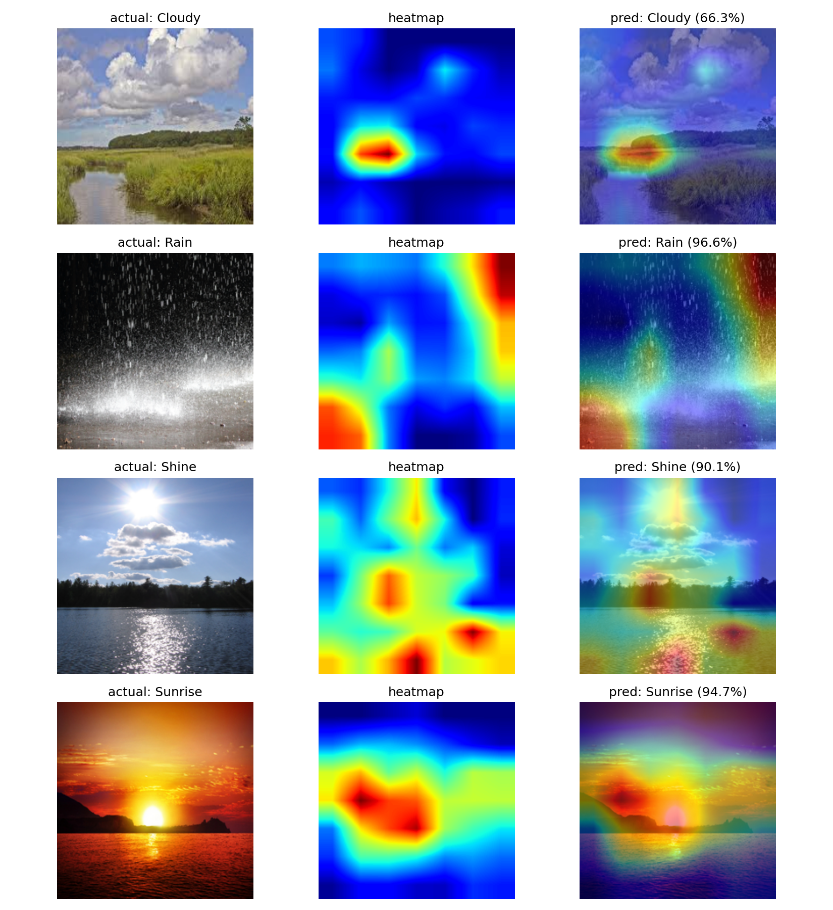
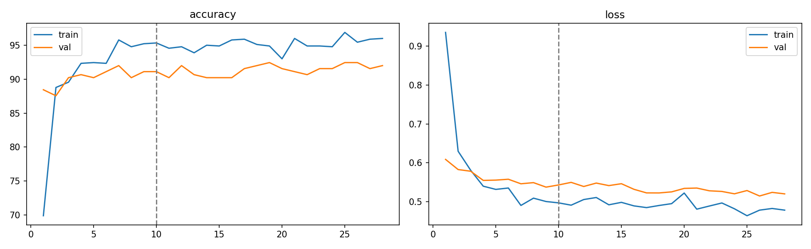
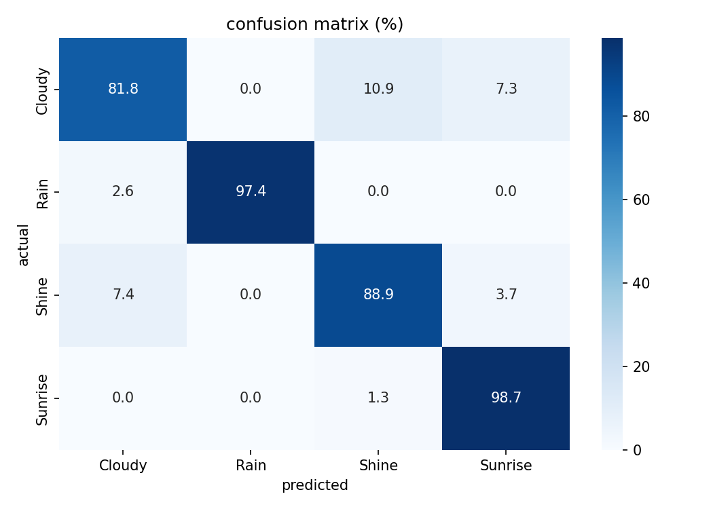

# Weather Image Classification

Classifying weather conditions from photos using efficientnet-b0 and grad-cam visualization.

**dataset:** [multi-class weather dataset](https://www.kaggle.com/datasets/pratik2901/multiclass-weather-dataset) — 1125 images across 4 classes (cloudy, rain, shine, sunrise)

---

## Results

| metric | value |
|--------|-------|
| validation accuracy | **91%** |
| model | efficientnet-b0 |
| training epochs | 18 (10 head + 8 finetune) |

```
              precision  recall  f1-score
    Cloudy       0.88     0.82     0.85
      Rain       0.97     0.97     0.97
     Shine       0.85     0.85     0.85
   Sunrise       0.94     0.99     0.96
  accuracy                         0.91
```

---

## How it works

two-phase transfer learning:

1. freeze all efficientnet weights, train only the new classifier head (lr=1e-3, 10 epochs)
2. unfreeze the last two feature blocks and fine-tune everything together (lr=1e-5, 8 epochs)

this approach converges faster and avoids destroying pretrained features early on.

---

## Data Pipeline

- checked all 1125 images for corruption with `PIL.Image.verify()` — 0 bad files found
- 80/20 train/val split
- augmentation on train only: horizontal flip, ±15° rotation, color jitter (brightness + contrast)
- normalized with imagenet mean/std since we're using a pretrained backbone

---

## Grad-CAM


Grad-CAM lets us see which regions of the image actually drive the model's prediction. two examples worth highlighting:

**sunrise** — the model locks onto the bright horizon glow and warm color gradient near the sun. it's not just detecting orange pixels; it focuses specifically on the light diffusion pattern at the edge of the sky, which is what separates sunrise from shine.

**cloudy** — attention spreads across the texture of the cloud cover rather than any single spot. the model picks up on flat, diffuse light and the absence of shadows — exactly what distinguishes overcast skies from the other classes.

this tells us the model learned genuinely meaningful visual features rather than shortcut patterns or background noise.







